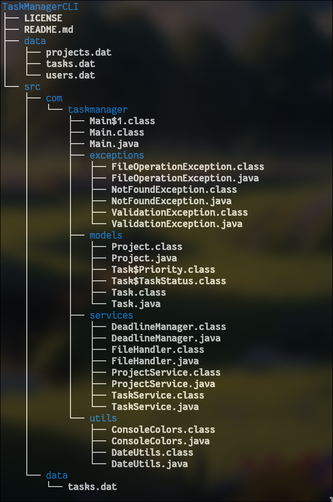

# TaskManagerCLI

A modern, feature-rich command-line application for managing projects and tasks with clarity, efficiency, and structure.

---

## Overview

**TaskManagerCLI** is a clean, object-oriented Java application designed to help developers and productivity-focused users organize projects, track tasks, and manage deadlines directly from the terminal. The tool provides persistent data storage, a color-coded interface, and a smooth, menu-driven workflow.

This CLI utility is ideal for users who prefer speed, simplicity, and terminal-based productivity.

---

## Features

### Project Management

* Create, update, delete, and view projects.
* Each project maintains its own set of tasks.
* Automatic project ID generation.

### Task Management

* Add, edit, delete, or update tasks.
* Supports attributes including:

  * Title
  * Description
  * Priority (`LOW`, `MEDIUM`, `HIGH`, `URGENT`)
  * Status (`PENDING`, `IN_PROGRESS`, `COMPLETED`)
  * Due Date

### Deadline Tracking

* Background thread continuously monitors approaching and overdue deadlines.
* Alerts for:

  * Tasks due today
  * Tasks due tomorrow
  * Overdue tasks
* Manual deadline check available from the menu.

### Persistent Storage

* Automatic reading and writing using Java serialization.
* Data stored in the `data/` directory.

### Terminal Interface

* Color-coded output for better readability:

  * Green for completed
  * Yellow for in-progress
  * Red for overdue
  * White for pending
* Clean and structured menu-driven navigation.

---

## Project Structure

---

## Installation & Running the Application

### **Method 1: Run Manually (Without Docker)**

### Requirements

* Java 17 or later
* A terminal or command prompt

### Steps

#### Clone the Repository

```bash
git clone https://github.com/<your-username>/TaskManagerCLI.git
cd TaskManagerCLI
```

#### Compile the Source Code

```bash
javac -d out src/com/taskmanager/**/*.java
```

#### Run the Application (Manual Method)

```bash
java -cp out com.taskmanager.Main
```

---

### **Method 2: Run Using Docker (Recommended for Data Persistence)**

#### Build the Docker Image

```bash
docker build -t taskmanager-cli .
```

#### Run with Volume Mount (so your data is never lost)

```bash
docker run -it --rm \
  -v "$(pwd)/data:/app/data" \
  taskmanager-cli
```

This command ensures that all saved tasks and projects inside the container are written to your **local `data/` folder**, preventing data loss.

---

#### Run the Application

```bash
java -cp out com.taskmanager.Main
```

---

## Key Concepts Used

| Concept                         | Description                                                         |
| ------------------------------- | ------------------------------------------------------------------- |
| **Object-Oriented Programming** | Organized structure using classes for projects, tasks, and services |
| **Serialization**               | Automatic data saving and loading                                   |
| **Exception Handling**          | Custom exceptions for validation and file operations                |
| **Enums**                       | Defines task priority and status clearly                            |
| **Date Handling**               | Uses `LocalDate` and `ChronoUnit` for scheduling                    |
| **Multithreading**              | Handles real-time deadline tracking                                 |

---

## Menu Preview

```
===== TASK MANAGER CLI =====

1. Create Project
2. View All Projects
3. Edit Project
4. Delete Project
5. Add Task
6. View Tasks
7. Edit Task
8. Delete Task
9. Mark Task Complete
10. Check Deadlines
11. Save Data
12. Exit

Choose an option:
```

---

## Roadmap

* User authentication system (`users.dat` ready for future use)
* Task filtering by status, priority, or date range
* Export data as JSON
* Desktop GUI version (Swing or JavaFX)
* Optional notification sound support

---

## License

This project is licensed under the **MIT License**. You are free to use, modify, and distribute it with attribution.

---
                                         I don’t just write code — I orbit ideas until they ignite.   

— Aman Deep
